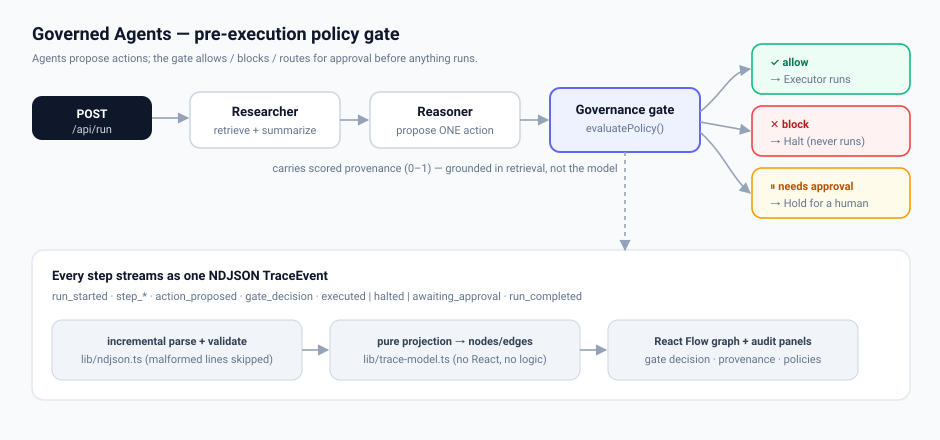

# Governed Agents

**Agents that know what they're _not_ allowed to do.**

Give an AI agent real tools and it will take real, irreversible actions — send the
email, write the record, delete the row — sometimes on weak or unverified evidence.
**Governed Agents** puts an explicit **policy gate** in front of every action an
agent proposes: the gate **allows**, **blocks**, or **routes for human approval**
_before_ anything runs, with scored provenance and an auditable, streamed trace of
exactly what happened and why.

**▶ Live demo: [governed-agents.vercel.app](https://governed-agents.vercel.app)** —
land, click **“Watch it block a risky action,”** then edit a policy threshold and
re-run to watch the same action flip from **blocked** to **allowed**. Zero setup;
the agents call a current Claude model server-side.



> 🎥 **90-second walkthrough:** _placeholder — add link here._
> <!-- Record a short Loom/YouTube clip (watch-it-block → edit policy → flip → raw trace) and drop the URL above. -->

---

## Why this exists (the thesis)

The interesting problem with agents isn't capability — it's **governance**. An agent
that can act needs a layer that decides, _per action_, whether it's allowed to. That
layer should be:

- **Pre-execution** — checked _before_ the side effect, not flagged after.
- **Explicit** — policy is named rules with thresholds, not vibes baked into a prompt.
- **Grounded** — decisions key off provenance that comes from retrieval, never
  fabricated by the model.
- **Auditable** — every step is an event on a trace you can inspect and replay.

The graph is the vehicle; **governance is the point.**

## See it in 30 seconds

| Try this | What it shows |
|---|---|
| **▶ Watch it block a risky action** | A guided walkthrough narrates, step by step, _why_ an outbound email is blocked: the only source scores 0.55, the rule requires ≥ 0.70, so the action halts before anything is sent. |
| **Edit the threshold → Re-run** | Lower `no-unverified-external-send` below 0.55 and the **same** action flips **BLOCK → ALLOW**. The flip is real: Sample recomputes the gate, Live re-runs the backend with your override. |
| **View raw trace** | The actual streamed `TraceEvent`s, in order, pretty-printed — proof it's a real NDJSON stream, not a canned animation. |
| **Scenario picker** | A spread of governance behaviors: confidence threshold, **PII leak**, and an **irreversible delete** that needs **human approval** (a third decision state). |

## How it works

A run is a small server-side loop — **Researcher → Reasoner → governance gate →
execute / halt / hold** — that emits **one `TraceEvent` per line (NDJSON)**, flushed
as each step completes. The browser parses it incrementally, validates every line,
projects it to a node/edge graph, and renders. The gate
([`lib/governance.ts`](lib/governance.ts)) is a pure, synchronous function, so its
decisions are deterministic and testable without a browser.

**Full data flow, transport, and the event schema:**
[`docs/ARCHITECTURE.md`](docs/ARCHITECTURE.md).

```ts
// the wire format (lib/trace-events.ts)
type TraceEvent =
  | { type: "run_started";       runId: string; task: string; at: string }
  | { type: "step_started";      stepId: string; role: AgentRole; at: string }
  | { type: "step_completed";    stepId: string; role: AgentRole; summary: string; provenance: Provenance[]; at: string }
  | { type: "action_proposed";   stepId: string; action: ProposedAction; at: string }
  | { type: "gate_decision";     stepId: string; decision: PolicyDecision; at: string }
  | { type: "executed";          stepId: string; result: string; at: string }   // allow
  | { type: "halted";            stepId: string; reason: string; at: string }   // block
  | { type: "awaiting_approval"; stepId: string; reason: string; at: string }   // needs-approval
  | { type: "run_completed";     runId: string; at: string }
  | { type: "error";             message: string; at: string };
```

## The policy

`evaluatePolicy(action, rules)` resolves a three-tier outcome — a hard **block**
beats a **review** request beats **allow**:

| Rule | Applies to | Decides |
|---|---|---|
| `require-provenance` | every action | **block** if no supporting sources |
| `no-unverified-external-send` | outbound `send_email` | **block** unless some source ≥ the confidence threshold (default **0.70**, editable in the UI) |
| `no-pii-in-external-output` | outbound `send_email` | **block** if the payload contains personal data (SSN / card / phone) |
| `destructive-action-needs-approval` | `delete_record` / destructive kinds | **needs-approval** unless an approval token is attached |
| `require-model-consensus` | multi-model (triad) runs | **needs-approval** when model agreement falls below the threshold (default unanimous) |
| `require-distinct-voices` | multi-model (triad) runs | **needs-approval** when the agreeing votes resolve to fewer than 2 distinct attested model instances — corroboration counts voices, not echoes |
| `red-cell-independence` | red-cell-reviewed actions | **needs-approval** when the reviewing instance is (or cannot be proven not to be) the proposing instance — oversight is theater otherwise |
| `red-cell-objection` | red-cell-reviewed actions | **needs-approval** when the adversarial reviewer objects, with the critique attached |

The thresholds are genuinely editable: they flow to the **Live** backend in the
request body, and the **Sample** replay **recomputes** the gate
([`lib/policy-replay.ts`](lib/policy-replay.ts)) rather than replaying a baked-in
decision — so the flip is real on both paths.

### Model consensus (the triad)

The Reasoner step can be decided by a **triad** — Claude + Gemini + Grok — voting on
the action ([`lib/consensus.ts`](lib/consensus.ts), [`lib/providers.ts`](lib/providers.ts)).
Each model proposes independently; if they don't agree, `require-model-consensus`
holds the run for a human instead of acting on a split decision. A provider with no
key simply **abstains**, so it degrades gracefully to a single model. Set
`GEMINI_API_KEY` + `XAI_API_KEY` to light up Live; the *“model triad agrees / splits”*
Sample scenarios demo it with zero keys.

### Attested independence + the Red Cell (oversight that can prove it's not theater)

Every vote now carries an attested **voice identity** — the configured
`(provider, model id)` pair — and the consensus records how many **distinct
instances** actually backed the chosen action. A unanimous "consensus" whose agreeing
votes resolve to one instance is one voice echoed N times; `require-distinct-voices`
routes it to a human instead of honoring it. After the action is chosen, the **Red
Cell** ([`lib/redcell.ts`](lib/redcell.ts)) — an adversarial *mode*, not a fourth
agent — runs on an instance provably distinct from the generator and makes the
strongest case against the action; the gate refuses to honor its verdict if the
voices collapse, and parks any objection for a human. Honest scope: for API-backed
voices this attests what we *configured and called* — it cannot see through a
provider's internal routing, and that residual trust is named, not papered over.
Verified headlessly (32 checks, zero keys): `npx tsx scripts/verify-governance.ts`.

Both are **glass-boxed in the trace UI**: the consensus panel shows each vote's attested
`provider/model` and flags an *echo* (agreeing votes that resolve to one instance); a Red
Cell panel shows the reviewer's verdict, its attested identity, and whether it's independent
of the proposer. Two Sample scenarios demo them with zero keys — *"unanimous, but one voice
echoed"* and *"the Red Cell objects"* — and the projections are pinned in `verify-trace`
(70 checks).

Verify your keys + model ids from the terminal before deploying:

```bash
npm run check:providers   # pings each configured provider, prints ✓/✗ per model
```

## The intervention console — where a human stops a bad merge

The gate and the Red Cell are *automated* control. The **intervention console**
([`/console`](http://localhost:3000/console)) is the **runtime human-in-the-loop** half —
the place an operator sits, watches a fleet, and intervenes. Three surfaces on one page,
pointed at the [flcason.com](https://flcason.com) genealogy reference impl:

- **Cosign queue** — the first *write path* in the stack. A `REQUIRE_COSIGN`-held action
  surfaces with full context; the operator approves or rejects; the decision routes back
  through the enforcement plane and lands in an append-only, hash-linked **Truth Chain**.
  The centerpiece is the **Cason↔Causey merge refusal**: two “Elias” records the matcher
  wants to merge, and the **Maryland-detour fingerprint** that proves they’re distinct
  lineages — a human visibly stopping a bad merge.
- **Fleet view** — read-only: ten agents, CAR ID, BASIS tier, status, attestation method.
- **Drift → quarantine** — a model swap caught on **Scribe** by weight-space **I(θ)** and
  the agent auto-quarantined.

Two design commitments make it credible:

- **Fail-closed.** No human ack before the TTL expires ⇒ **auto-reject** + audit. Silence is
  refusal, not release. (Default 15m; tighter per action type.)
- **Honest drift.** Weight-space I(θ) needs the weights, so it applies *only* to Scribe (the
  one self-hosted open-weight agent); the nine API-backed agents are attested by
  **canary-probe** behavioral checks, never by I(θ). The `DriftEvent` type makes the wrong
  claim impossible to express.

Simulator-first and adapter-swappable: it runs today with **zero infrastructure** and is
safe for public exposure (synthetic, no bridge to a real agent). Flipping to the live
CogniGate/ASTS + Supabase path is one env var (`GOVERNANCE_SOURCE`). Full write-path boundary,
data model, and limitations: [`docs/COSIGN.md`](docs/COSIGN.md). Verified headlessly
(38 checks, zero infra): `npm run verify:cosign`.

## Quickstart

```bash
npm install
cp .env.example .env.local   # optional — ANTHROPIC_API_KEY for live models; omit to use the offline stub
npm run dev                  # http://localhost:3000

# headless / CI
npm run typecheck            # strict TS, no `any`
npm run check:model          # verify the configured Claude model ids are current
npx tsx scripts/verify-trace.ts   # projection + parser + policy-flip contract (52 checks)
AGENTS_OFFLINE=1 npm run demo     # run the seed tasks and print the stream (allow + block)
```

With no `ANTHROPIC_API_KEY` the loop uses a deterministic **offline stub**, so it
runs end-to-end with zero setup; set the key (server-only) for live Claude calls.
Models (override via env): Researcher `claude-haiku-4-5`, Reasoner
`claude-sonnet-4-6`, Executor `claude-haiku-4-5`.

## Tech stack

Next.js 15 (App Router) · React 19 · TypeScript (strict, `noUncheckedIndexedAccess`,
no `any`) · Tailwind CSS · React Flow (`@xyflow/react`) · `@anthropic-ai/sdk`
server-side, with Gemini + Grok over guarded REST for the consensus triad · deployed
on Vercel.

## Design decisions & tradeoffs

- **NDJSON, not SSE.** One JSON object per line streams incrementally with zero
  framing overhead and is trivial to validate line-by-line. The parser stays
  resilient to truncation and noise (there's a “Inject malformed lines” toggle that
  proves bad lines are skipped, not fatal).
- **The UI is a pure projection of the event log.** All logic lives in
  `lib/trace-model.ts` (`TraceEvent[] → {nodes, edges, status}`); React just renders
  it. That's why Live and Sample render through the _same_ code, and why a headless
  script can contract-test the whole projection without a browser.
- **Provenance is grounded in retrieval, never the model.** The Reasoner proposes an
  action but the scores attached to it come from the retriever — so the gate can
  trust them. The model is explicitly told _not_ to self-police; the gate does.
- **The gate is pure and synchronous.** Decisions are deterministic and unit-testable,
  and the same `evaluatePolicy` powers Live, the Sample recompute, and CI.
- **Sample recomputes, it doesn't replay.** Making the editable-policy flip _real_ on
  the recorded path meant re-running the gate over the fixture's proposed action
  instead of replaying its baked-in decision — otherwise editing a rule would be
  theater.
- **Cold start is a UX problem, not just an infra one.** A serverless first hit can
  5xx while booting; the client treats that as a “warming” state and auto-retries
  before consuming the stream, and pre-warms with a cheap `GET`, so a reviewer's
  first click never looks broken.

## What I'd build next

- **Human-in-the-loop approval that resolves** — _built_ as the
  [intervention console](docs/COSIGN.md): a cosign queue where an operator approves/rejects a
  held action and the decision routes back to the enforcement plane (fail-closed on timeout).
- **Durable audit log** — _built_ as the hash-linked **Truth Chain** (append-only, server-only
  writes, tamper-evident); persisted to Postgres on the live path (`supabase/`).
- **Policy as data** — load rules/thresholds from a versioned config or small DSL,
  with per-rule provenance requirements, instead of code.
- **An eval harness** — a labeled set of (task → expected decision) cases run in CI to
  catch policy regressions, with precision/recall on block decisions.
- **More gate types** — rate limits, spend caps, recipient allowlists, and
  data-residency rules, composed into named policy bundles.

## Project layout

```
app/api/run/route.ts   POST /api/run — streams NDJSON; optional policy override
lib/loop.ts            the orchestrator: Researcher → Reasoner → gate → execute/halt/hold
lib/agents.ts          the three agents (provenance grounded in retrieval)
lib/governance.ts      the gate: types, evaluatePolicy(), the policy rules  ← the thesis
lib/policy-replay.ts   recomputes the gate over a recorded run (real flips on Sample)
lib/trace-events.ts    the TraceEvent wire format (NDJSON)
lib/ndjson.ts          incremental parser + runtime validation (skips malformed lines)
lib/trace-model.ts     pure projection TraceEvent[] → nodes/edges/status
components/            React Flow canvas + hero + guided walkthrough + audit panels
mocks/trace.sample.ts  recorded runs for the instant Sample mode
scripts/verify-trace.ts headless contract test (CI)
docs/ARCHITECTURE.md   data flow + full event schema
docs/STATUS.md         current state, decisions, operational setup + open items
examples/governed-trader/  the same gate on a trade — the canonical irreversible action

# the intervention console (cosign · fleet · drift) — see docs/COSIGN.md
app/console/page.tsx          RSC first paint → the client console
app/_actions/cosign.ts        decideCosign Server Action (audit-before · submit · audit-after)
app/api/governance/stream     realtime NDJSON: fleet snapshot, holds arriving, drift firing
app/api/governance/sweep      fail-closed TTL sweeper (Vercel Cron backstop)
governance/types.ts           Zod schemas at every boundary (BASIS tier, holds, method-aware drift)
governance/source.ts          the adapter boundary (sim/live swappable)
governance/sources/simulator.ts  zero-infra: scripts the Cason↔Causey hold + the Scribe I(θ) drift
governance/sources/cognigate.ts  live CogniGate/ASTS adapter — inert until G2/G3 (no fake approvals)
governance/audit.ts           the hash-linked Truth Chain (append-only, server-only)
components/console/            fleet rail · cosign queue · the hold card · drift panel · audit trail
supabase/                     migrations + RLS for the live persistence path
scripts/verify-cosign.ts      headless: round-trip · audit chain · fail-closed · drift · Zod (CI)
```

## Example — the gate on the action that matters most

[`examples/governed-trader`](examples/governed-trader) points this repo's idea — a typed
pre-execution gate with named rules and a streamed NDJSON trace — at a **trade**, the
canonical irreversible, real-money action. Same loop shape (propose → gate →
execute/hold/block), zero dependencies, CPU-only, on **frozen real** data across two
asset classes — 24/7 crypto and calendar-bound US equities/ETFs (with cash dividends,
opening-gap circuit-breakers, and FINRA-style rules); no orders are ever placed. It makes
two hand-waved claims measurable: governance (the *only* variable is the gate — an
ungoverned order stream breaches hard rules on 16 crypto / 120 equity decisions, the
governed runs on **0**, and on crypto it cuts max drawdown from −3.7% to −2.6%) and honesty
(a backtest auditor that isolates four lies — lookahead, zero-cost, hindsight universe,
ignored dividends — and **refuses to attest** each, plus an eval that names which rules
actually bound vs. which are only proven in the self-tests). Run it from that directory:

```sh
cd examples/governed-trader
npm test               # gate · conductor · audit · equities self-tests (66 assertions)
node eval/run_eval.js  # reproduce the claims on both asset classes
npm run trace          # stream a real NDJSON audit trace of a governed run
```

## Composed in production

The `evaluatePolicy` + `TraceEvent` contract here is ported into a live consumer:
[**cason-heritage**](https://github.com/axiom-orion/cason-heritage) ([flcason.com](https://flcason.com)).
Its genealogy "Keeper" decides every proposed record with the same typed gate
(allow / needs-approval / block, named rules with thresholds) and writes the same
NDJSON `TraceEvent` audit trail — the gate and the glass-box you can watch in the demo
here, running on a real family's record.

## About

Built by **[axiom-orion](https://github.com/axiom-orion)** as a portfolio project
exploring agent governance. Source:
**[github.com/axiom-orion/governed-agents](https://github.com/axiom-orion/governed-agents)**.
The deployed app links back to this repo and to the architecture docs from its header.

## License

[MIT](LICENSE).
